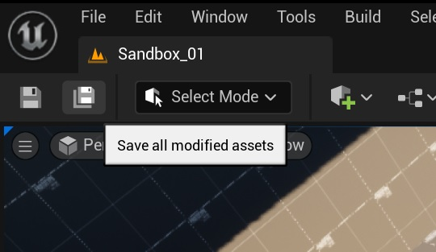

# Save All button plugin

This plugin adds Save All button to the Unreal Engine 4 Editor toolbar. 

When clicking the button does the same thing as Save All button in the content drawer.

## Screenshots

## Installation

To install just copy the source code to your game project `Plugins` folder.

## License

Save All button plugin is released under the MIT license, see [LICENSE.md](LICENSE.md) for full text as well as 3rd party library acknowledgements.